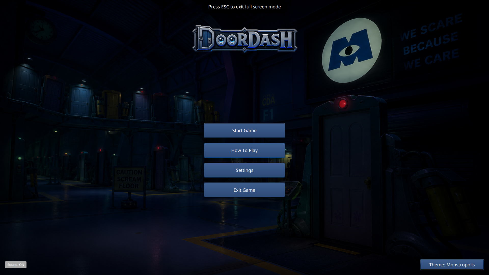
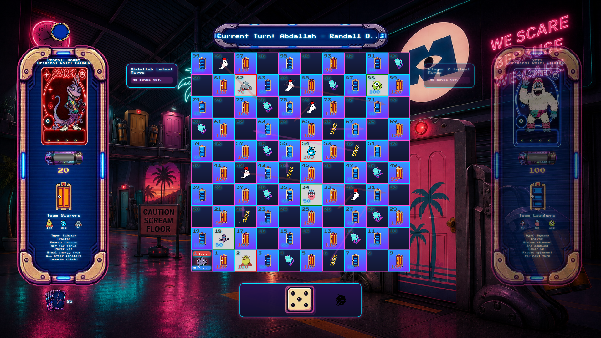
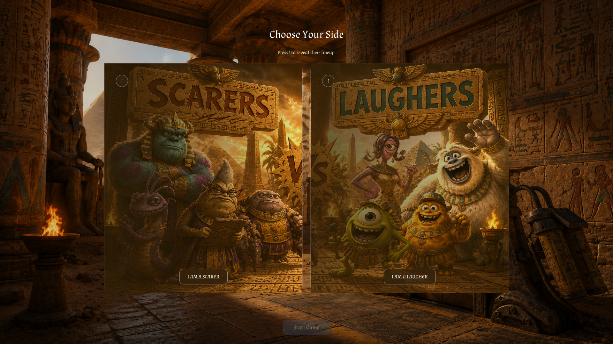
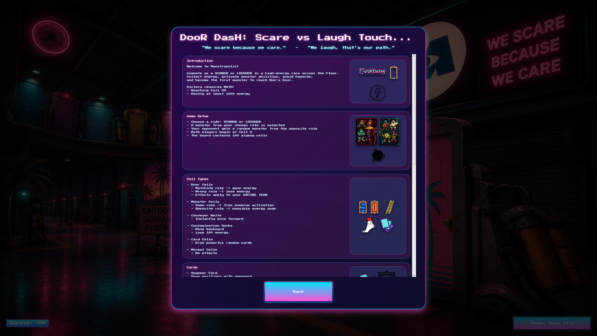

# DoorDash: Monsters Inc. Board Game

This is our CSEN401 course project. It is a JavaFX board game based on _Monsters, Inc._ Players move around the board, use cards, deal with monsters, and try to reach the end.

## Screenshots

|  |  |
| -------------------------------------------- | -------------------------------------------- |
|  |  |

## Requirements

- Java JDK 21
- Maven 3.9 or newer

## Running the Game

Run these commands from the project folder:

```bash
mvn clean package
mvn javafx:run
```

The game starts from `game.view.Main`. Run it from the project folder because it reads the CSV files from there.

## Project Files

```text
src/             Java code and game assets
cards.csv        Card data
cells.csv        Board data
monsters.csv     Monster data
pom.xml          Maven build file
```

The assets are in `src/game/assets/`. This includes the images, sounds, fonts, CSS, and the different themes.

## Themes

The game currently has three themes:

- Monstropolis
- Vice City
- Giza

Theme files are located in `src/game/assets/`, `src/game/assets/retro/`, and `src/game/assets/ancientEgypt/`.
